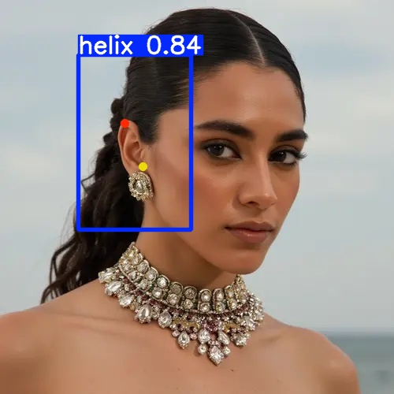
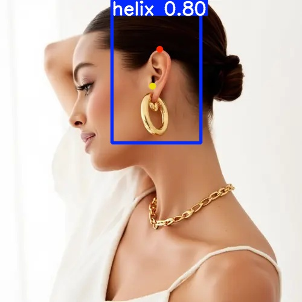
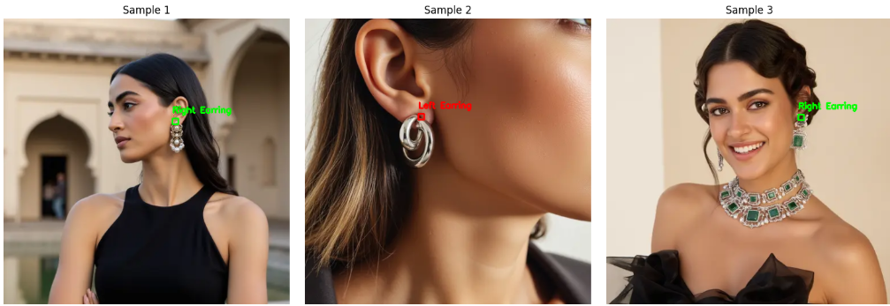

# Computer Vision Pose Estimation using YOLOv8

A computer vision project focused on custom object and keypoint detection using YOLOv8 and PyTorch. The project includes dataset preparation, annotation validation, model training, ONNX optimization, and inference pipelines for real-world image analysis.

---

## Project Overview

This project was developed to explore the complete computer vision workflow, from dataset creation and preprocessing to model training, evaluation, and deployment-ready inference.

Key areas explored:

- Data Collection and Annotation
- Data Cleaning and Validation
- Model Training using YOLOv8
- ONNX Model Conversion
- Performance Evaluation
- Computer Vision Inference Pipeline

---

## Tech Stack

- Python
- PyTorch
- YOLOv8
- OpenCV
- NumPy
- Matplotlib
- ONNX Runtime

---

## Project Workflow

1. Dataset Collection
2. Annotation Verification
3. Data Preprocessing
4. YOLOv8 Model Training
5. Evaluation and Error Analysis
6. ONNX Model Export
7. Production Inference Pipeline

---

## Sample Annotations



---

## Model Predictions



---

## Evaluation Results



---

## Features

- Custom annotated dataset
- Automated annotation verification
- Training and validation pipelines
- Error analysis tools
- ONNX deployment support
- Production-ready inference workflow

---

## Repository Structure

```text
.
├── README.md
├── sample_annotations.jpg
├── model_prediction.jpg
├── evaluation_results.png
```

---

## Future Improvements

- Larger dataset collection
- Hyperparameter optimization
- Real-time inference support
- Deployment as a web application
- Model performance benchmarking

---

## Author

Nandini Patni

Computer Science Student | AI/ML | Computer Vision

LinkedIn:
https://www.linkedin.com/in/nandini-patni-835249309/

GitHub:
https://github.com/nandinipatni
